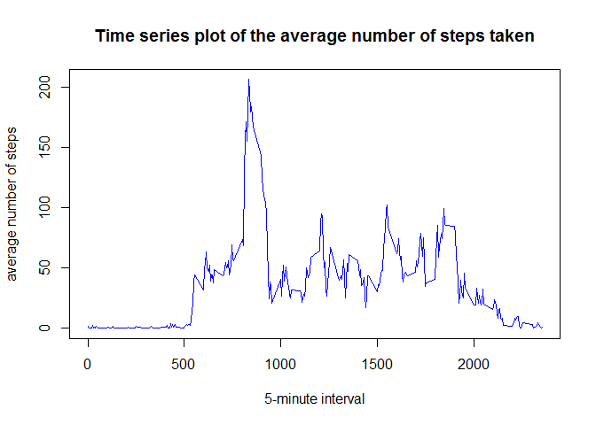

## Loading and preprocessing the data

### Load packages

```r
library(knitr)
library(dplyr)
```

```
## 
## Attaching package: 'dplyr'
```

```
## The following objects are masked from 'package:stats':
## 
##     filter, lag
```

```
## The following objects are masked from 'package:base':
## 
##     intersect, setdiff, setequal, union
```

```r
library(lattice)
```

### Always include the code used to generate the presented output


```r
opts_chunk$set(echo=TRUE)
```

### Set working directory and load the data


```r
setwd("C:/Coursera/rep_research/RepData_PeerAssessment1")
unzip("activity.zip")
data <- read.csv("activity.csv",header=TRUE,colClasses=c("numeric","factor","numeric"))
```

## What is mean total number of steps taken per day?

### Total number of steps taken each day


```r
totalSteps <- data %>% filter(!is.na(steps)) %>% group_by(date) %>% summarize(number_steps=sum(steps))
totalSteps
```

```
## # A tibble: 53 x 2
##          date number_steps
##        <fctr>        <dbl>
##  1 2012-10-02          126
##  2 2012-10-03        11352
##  3 2012-10-04        12116
##  4 2012-10-05        13294
##  5 2012-10-06        15420
##  6 2012-10-07        11015
##  7 2012-10-09        12811
##  8 2012-10-10         9900
##  9 2012-10-11        10304
## 10 2012-10-12        17382
## # ... with 43 more rows
```

### Histogram of the total number of steps taken each day


```r
hist(totalSteps$number_steps,breaks=20,main="Total number of steps taken each day",xlab="Number of steps",col="lightblue")
```

<!-- -->

### Mean and median number of steps taken each day


```r
mean(totalSteps$number_steps)
```

```
## [1] 10766.19
```

```r
median(totalSteps$number_steps)
```

```
## [1] 10765
```

## What is the average daily activity pattern?

### Time series plot of the average number of steps taken


```r
time_series <- data %>% filter(!is.na(steps)) %>% group_by(interval) %>% summarize(average=mean(steps))
plot(time_series,type="l",main="Time series plot of the average number of steps taken",xlab="5-minute interval",ylab="average number of steps",col="blue")
```

<!-- -->

### The 5-minute interval that, on average, contains the maximum number of steps


```r
time_series[which.max(time_series$average),]
```

```
## # A tibble: 1 x 2
##   interval  average
##      <dbl>    <dbl>
## 1      835 206.1698
```

## Imputing missing values

### Total number of missing values in the dataset (i.e. the total number of rows with NAs)


```r
sum(!complete.cases(data))
```

```
## [1] 2304
```

### New dataset with missing data filled in


```r
NAs <- is.na(data$steps)
mean_interval <- tapply(data$steps,data$interval,mean,na.rm=TRUE)
data_complete <- data
data_complete$steps[NAs] <- mean_interval[as.character(data_complete$interval[NAs])]
```

### Total number of steps taken each day (new dataset)


```r
totalSteps_new <- data_complete %>% group_by(date) %>% summarize(number_steps=sum(steps))
totalSteps_new
```

```
## # A tibble: 61 x 2
##          date number_steps
##        <fctr>        <dbl>
##  1 2012-10-01     10766.19
##  2 2012-10-02       126.00
##  3 2012-10-03     11352.00
##  4 2012-10-04     12116.00
##  5 2012-10-05     13294.00
##  6 2012-10-06     15420.00
##  7 2012-10-07     11015.00
##  8 2012-10-08     10766.19
##  9 2012-10-09     12811.00
## 10 2012-10-10      9900.00
## # ... with 51 more rows
```


### Histogram of the total number of steps taken each day (new dataset)


```r
hist(totalSteps_new$number_steps,breaks=20,main="Total number of steps taken each day (new dataset)",xlab="Number of steps",col="lightgreen")
```

<!-- -->

### Mean and median number of steps taken each day (new dataset)


```r
mean(totalSteps_new$number_steps)
```

```
## [1] 10766.19
```

```r
median(totalSteps_new$number_steps)
```

```
## [1] 10766.19
```

The mean value remains the same. The median value is now equal to the mean value.

Imputing missing data has an impact on the median value and on the frequency count for the mean value which is now higher.

## Are there differences in activity patterns between weekdays and weekends?

### Create a new factor variable


```r
data_complete$day_type <- weekdays(as.Date(data_complete$date))
weekend <- which(data_complete$day_type=="Saturday" | data_complete$day_type=="Sunday")
weekday <- which(data_complete$day_type!="Saturday" & data_complete$day_type!="Sunday")
data_complete$day_type[weekend] <- "weekend"
data_complete$day_type[weekday] <- "weekday"
data_complete$day_type <- factor(data_complete$day_type,levels=c("weekday","weekend"))
```

### Make a panel plot


```r
avg_steps <- data_complete %>% group_by(interval,day_type) %>% summarize(steps=mean(steps))
xyplot(steps~interval | day_type, data=avg_steps,type="l",layout=c(1,2))
```

<!-- -->


